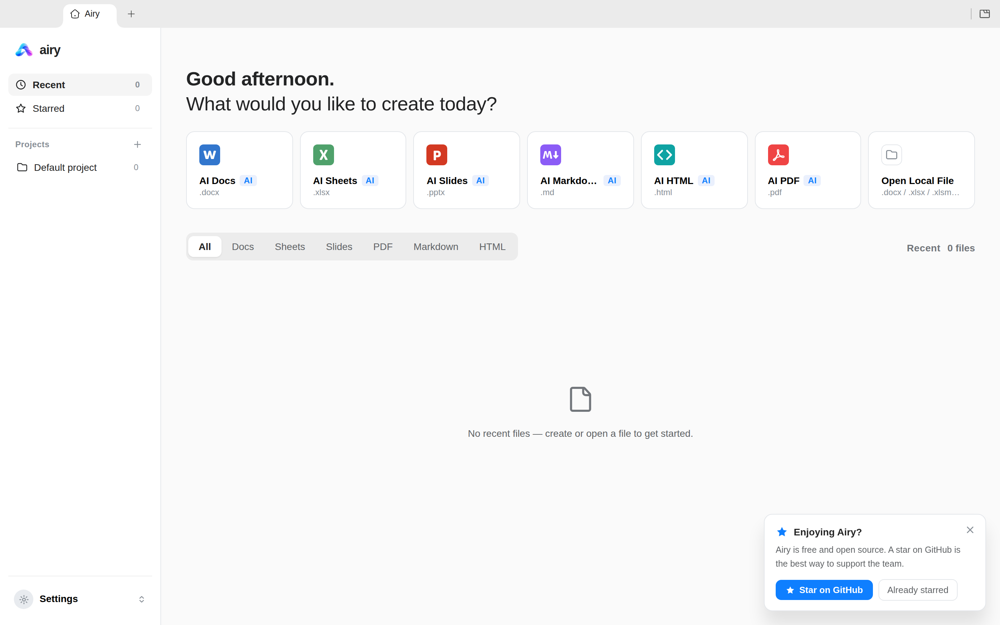
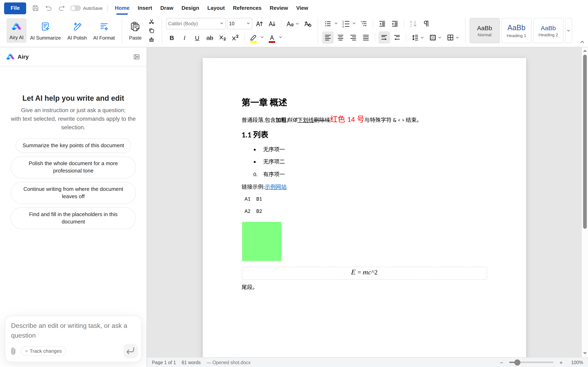
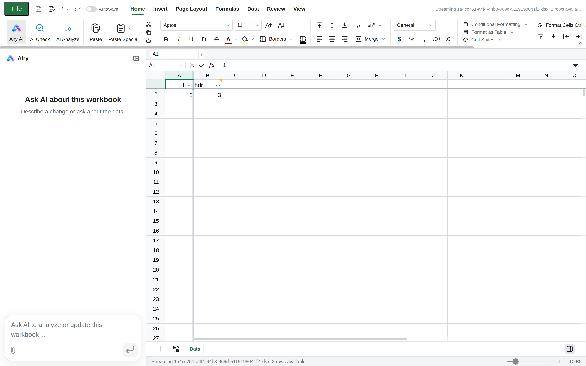
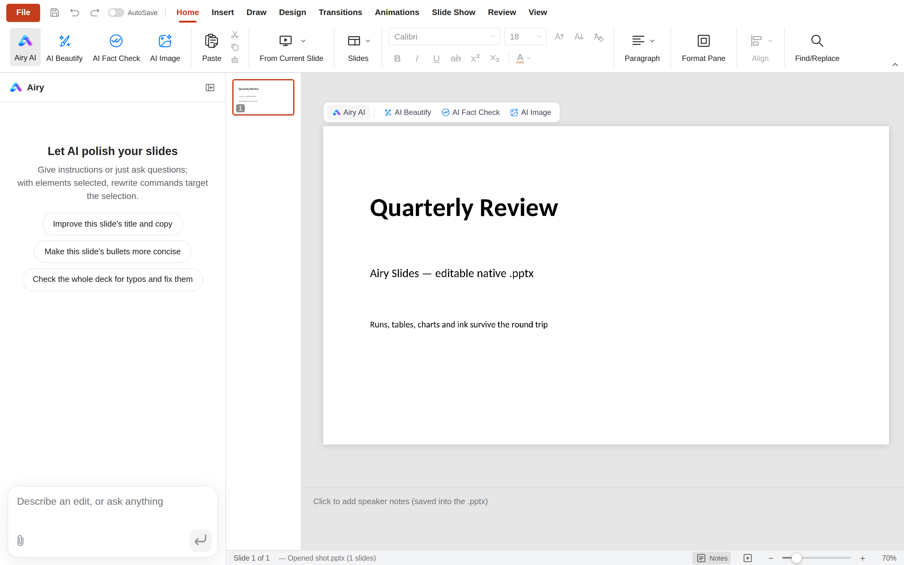

# Airy

<p align="center"></p>

Airy is an open-source office suite (docs, sheets, slides, PDF, Markdown,
HTML) with a built-in **MCP copilot**: a Model Context Protocol server that
lets CLI coding agents — Claude Code, ZCode, and any other MCP client — open,
read, and edit real `.docx` / `.xlsx` files headlessly, or edit the document
that is open in the running Airy app.

- **Real formats, byte-preserving.** Documents are opened with the suite's
  own engines (a ProseMirror-based docx engine, an in-house Rust xlsx
  engine) — not lossy re-serialization libraries. Untouched parts of a file
  survive a round trip byte-for-byte.
- **Headless first.** The MCP server (`packages/mcp-server`) runs as a plain
  Node process over stdio. No GUI, no Electron, no installed app required.
- **Live editing.** When the Airy desktop app is running, the same server
  connects to it through a local bridge and edits the _active_ document —
  tracked changes, one undo step per agent turn, visible immediately.
- **Local by design.** Everything file-related happens on your machine.

## Screenshots

<p align="center">
  
  
  <br>
  
  
</p>

Home, Docs, Sheets, and Slides in the default light theme. The captures are
generated by `e2e/screenshots.spec.ts` and committed under
`docs/assets/screenshots/`.

## Download

Prebuilt installers for every release are on
[github.com/besliky/airy/releases/latest](https://github.com/besliky/airy/releases/latest):

- **Windows** — `airy-<version>-setup.exe` (NSIS installer, x64)
- **Linux** — `airy_<version>_amd64.deb` (Debian/Ubuntu) and
  `airy-<version>-x86_64.AppImage` (runs on any distro); an `.rpm` is
  published alongside them
- **macOS** — `Airy-<version>.dmg` and `Airy-<version>-mac.zip` (arm64)

The installers are **not code-signed**. Windows SmartScreen, some Linux
desktops, and macOS Gatekeeper will warn about an unknown publisher — that is
expected for an unsigned fork; check the release notes and the CI build that
produced the artifact, or [build from source](#development) instead.

Every installer also bundles the **MCP server** (`resources/mcp/index.js`), so
coding agents can run it straight from the installed app — no Node.js and no
repo checkout required. See
[docs/COPILOT.md](docs/COPILOT.md#run-the-mcp-server-from-an-installed-airy-app)
for the ready-made agent configs.

## What is different from upstream

Airy is an independent fork of
[GenOffice](https://github.com/genspark-ai/genoffice). The fork's focus is
agent-driven document work, and it diverges in three ways:

1. **De-Genspark.** The Genspark account login, the `genspark` AI provider,
   the `gsk` CLI search backend, the `@genspark/cli` dependency, upstream's
   auto-updater, and usage analytics are removed. AI in the app is
   bring-your-own-key only. `tools/check-no-genspark.mjs` guards against
   Genspark network endpoints and dependencies coming back. In upstream's
   updater's place the fork ships its own GitHub-Releases updater
   (`apps/shell/src/main/updater/`, Windows and AppImage): it checks
   `github.com/besliky/airy` shortly after startup but only notifies — the
   download and the install (with restart) each need explicit consent, deb
   installs get a click-through notice, and macOS stays off. Releases are
   unsigned; see [SECURITY.md](SECURITY.md) for the updater posture.
2. **MCP server.** `packages/mcp-server` (`@airy-office/mcp`, bin
   `airy-mcp`) exposes the document engines to coding agents over MCP —
   see [docs/COPILOT.md](docs/COPILOT.md).
3. **Live bridge.** The desktop app listens on a local socket (UDS / named
   pipe) and publishes `airy-bridge.json` with a per-session token; the MCP
   server uses it for the `live_*` tools.

## Quick start: MCP for coding agents

```bash
git clone https://github.com/besliky/airy.git
cd airy
npm install
npm run build -w packages/mcp-server
# server entry point: packages/mcp-server/dist/index.js
```

**Claude Code** (project scope):

```bash
claude mcp add --scope project --transport stdio airy \
  -- node /abs/path/to/airy/packages/mcp-server/dist/index.js
```

`.mcp.json` (project scope) is equivalent:

```json
{
  "mcpServers": {
    "airy": { "command": "node", "args": ["/abs/path/to/airy/packages/mcp-server/dist/index.js"] }
  }
}
```

Verify with `claude mcp list` and `/mcp`; tools appear as `mcp__airy__*`.
A permissions preset that auto-approves reads and asks before writes:

```json
{
  "permissions": {
    "allow": ["mcp__airy__read_*", "mcp__airy__open_*"],
    "ask": ["mcp__airy__*write*", "mcp__airy__live_*"]
  }
}
```

**ZCode** (user scope, `~/.zcode/cli/config.json`):

```json
{
  "mcp": {
    "servers": {
      "airy": {
        "type": "stdio",
        "command": "/abs/path/to/node",
        "args": ["/abs/path/to/airy/packages/mcp-server/dist/index.js"],
        "enabled": true,
        "timeoutMs": 60000
      }
    }
  }
}
```

Workspace scope is the same JSON in `<repo>/.zcode/config.json`. If Node
comes from nvm, use its absolute path in `command`.

The full guide — every tool, the live mode, environment variables, format
support and limits, and the security model — is in
[docs/COPILOT.md](docs/COPILOT.md).

## Status

| Area                                                                           | State           |
| ------------------------------------------------------------------------------ | --------------- |
| MCP server foundation (stdio, SDK v1, path confinement)                        | done            |
| Headless docx: open / read / insert / apply_ops / save                         | done            |
| Live mode: `live_status` / `live_get_context` / `live_apply_ops` / `live_undo` | done            |
| Headless xlsx via the Rust sidecar (read / save, recalc)                       | done            |
| Legacy & ODF import: `.xls` / `.ods` (convert), `.doc` / `.odt` (soffice)      | done            |
| De-Genspark (provider, login, gsk CLI, updater, analytics)                     | done            |
| Branding: build configs, README, docs                                          | done            |
| i18n brand strings, UI marks, packaged distribution                            | done (phase 4b) |
| Slides / PDF / Markdown / HTML headless tools                                  | backlog         |

## Development

```bash
npm install
npm run fixtures     # generate test .docx fixtures
npm test             # engine + app unit tests (docs/sheets/slides need no display)
npm run typecheck    # tsc --noEmit across every workspace
npm run lint         # eslint
npm run licenses     # dependency license gate
npm run check:no-genspark  # egress guard: no Genspark endpoints or deps
npm run dev          # all six editors + shell against Vite dev servers
npm run dist:linux   # package Linux AppImage + deb + rpm (also dist:mac / dist:win)
```

The sheets app additionally needs a Rust toolchain for its xlsx sidecar
(`cargo` on PATH); `npm run build -w @airy-office/sheets` compiles it
automatically. See [CONTRIBUTING.md](CONTRIBUTING.md) for the checks every
change must pass and [CHANGELOG.md](CHANGELOG.md) for the release history.

## Provenance and license

Airy is a fork of **GenOffice** by **Genspark** (Mainfunc, Inc.), licensed
under the [Apache License 2.0](LICENSE). The fork keeps the upstream
license and the [NOTICE](NOTICE) file — Apache-2.0 §4(d) attribution of the
upstream work is mandatory for redistributions. The `ee/` directory is
covered by the upstream GenOffice Enterprise License
([ee/LICENSE](ee/LICENSE)).

The GenOffice and Genspark names and logos are trademarks of Mainfunc, Inc.;
this fork uses its own branding.

## Security

See [SECURITY.md](SECURITY.md) for the process security posture and
[docs/COPILOT.md](docs/COPILOT.md) for the MCP server's security model
(path confinement, token file permissions, lock refusal).
